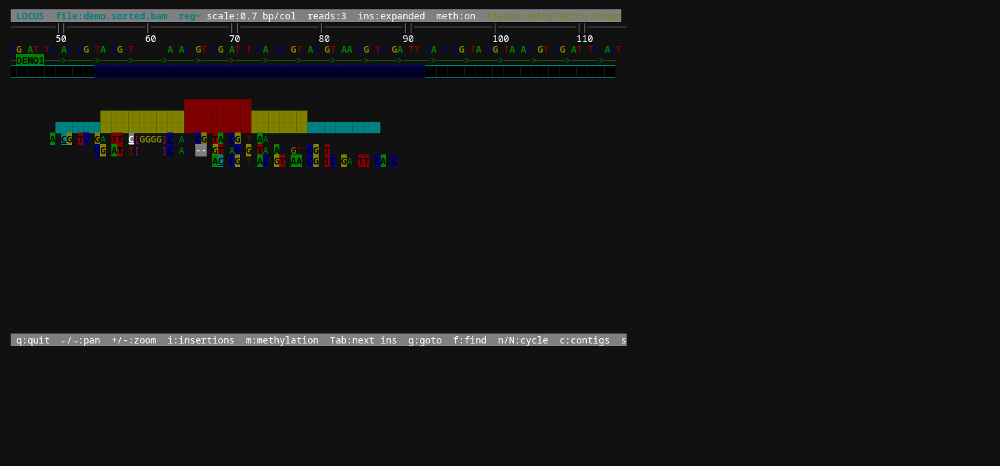
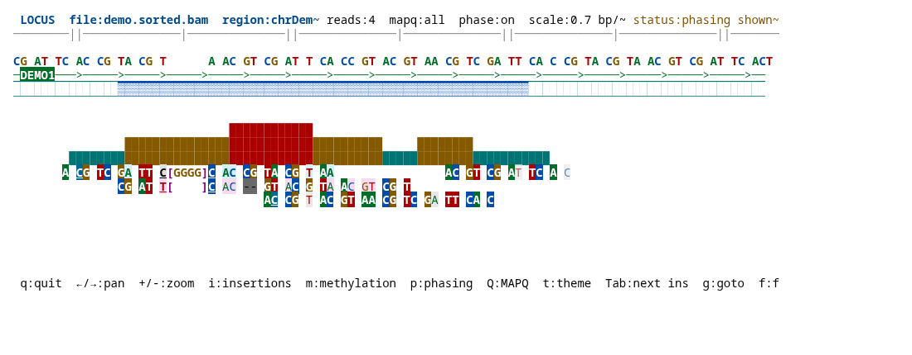

# locus

A fast terminal genome browser for BAM files.

## Install

```bash
cargo install locus-tui
```

For local development:

```bash
cargo build --release
# binary at target/release/locus
```

Requires Rust 1.85+ (edition 2024).

## Usage

```bash
# Open a BAM (auto-detects sample.bam.bai)
locus sample.bam

# Jump to a region on startup
locus sample.bam --region chr1:100000-101000
locus sample.bam --region "chr1:1,000,000-1,001,000"

# With a reference track and base-colored mismatches
locus sample.bam --reference hg38.fa

# With annotations for feature rendering and gene search
locus sample.bam --gff hg38.ncbiRefSeq.gtf.gz

# Start in light mode
locus sample.bam --light

# Prepare a sorted, BGZF-compressed, tabix-indexed annotation file
locus prepare-annotations hg38.ncbiRefSeq.gtf --output hg38.ncbiRefSeq.sorted.gtf.gz
```

The BAM must be coordinate-sorted and indexed (`.bai` file beside it).
When `--region` is omitted, locus opens a 1,000 bp window around the first mapped read.
Annotation files can be GFF3 or GTF, plain text or gzip/BGZF-compressed.
If a BGZF-compressed annotation has a `.tbi` sidecar, visible feature rendering uses indexed region queries.
Reference FASTA files use a `.fai` index when present; plain or gzip-compressed FASTA can also be loaded directly.

## Demo Dataset

A tiny synthetic dataset is included under [`examples/demo/`](examples/demo/). It contains a reference FASTA, source GFF, source SAM, a sorted/indexed BAM, and a prepared BGZF+tabix annotation file.

```bash
cargo run -- examples/demo/demo.sorted.bam \
  --region chrDemo:45-115 \
  --reference examples/demo/demo.fa \
  --gff examples/demo/demo.sorted.gff.gz
```

The demo region includes:
- a read insertion that can be expanded with `i` then `Tab`
- a deletion rendered as `--`
- MM/ML methylation calls shown with `m`
- a feature track loaded from a tabix-indexed GFF
- an app-generated screenshot captured with `s`
- dark and light terminal color themes toggled with `t`





The committed images were rendered from app-generated HTML screenshots under [`docs/captures/`](docs/captures/). To rebuild the demo data, run:

```bash
examples/demo/build.sh
```

To refresh the app-generated HTML/ANSI captures and PNG, run `examples/demo/capture.sh`.

## Keybindings

| Key | Action |
|-----|--------|
| `q` | Quit |
| `h` / `←` | Pan left (small step) |
| `l` / `→` | Pan right (small step) |
| `H` | Pan left (large step) |
| `L` | Pan right (large step) |
| `+` / `=` | Zoom in |
| `-` | Zoom out |
| `i` | Toggle expanded insertion sequence |
| `m` | Toggle read methylation display |
| `t` | Toggle dark/light theme |
| `Tab` / `Shift+Tab` | Move to next / previous expanded insertion |
| `g` | Go to region (e.g. `chr1:100000-200000`) |
| `c` | Contig selector |
| `r` | Refresh current region |
| `s` | Save ANSI text and HTML screenshots to `screenshots/` |
| `?` | Toggle help overlay |
| `Esc` | Cancel input |
| `Enter` | Confirm input |

## UI Layout

```
┌─────────────────────────────────────────────────────────┐
│ locus  sample.bam  chr1  100000-101000   12.5 bp/col  42 reads │  ← top bar
├─────────────────────────────────────────────────────────┤
│ 100,000        100,500        101,000                   │  ← coordinate ruler
├─────────────────────────────────────────────────────────┤
│ ▄▄▅▅▆▆█████▆▆▅▅▄▄▃▃▂▂▁▁                               │  ← coverage histogram
├─────────────────────────────────────────────────────────┤
│ >>>>>>>>>>>>>>>>>>>>>>>>>>>>>>>--<<<<<<<<<              │  ← read pileup
│ >>>>>>>>>>>>>>>>>>>>>>>>>>                              │
│ >>>>>>>>>>>>>>>>>>>X>>>>>>>>>>>>>>>>>>>>>>>>>           │
└─────────────────────────────────────────────────────────┘
│ q:quit  h/l:pan  H/L:big pan  +/-:zoom  g:goto  ?:help │  ← bottom bar
```

## Read Rendering

Reads are colored by mapping quality:
- **Green**: MAPQ ≥ 60
- **Light green**: MAPQ ≥ 30
- **Yellow**: MAPQ ≥ 10
- **Gray**: MAPQ < 10

CIGAR operations:
- `>` / `<` — alignment match (forward / reverse strand)
- base-colored highlight — sequence mismatch against the reference
- `I` — insertion into reference
- `-` — deletion from reference
- `~` — skip / intron (N)
- `S` — soft clip

In the demo screenshot, the `read_ins_meth` insertion is expanded as `[GGGG]`, while the `read_del` deletion is visible as `--`.

Methylation display:
- Press `m` to show or hide modified-base calls parsed from SAM/BAM `MM` tags.
- `ML` probabilities are used when present: high-confidence modified calls are highlighted more strongly, low-confidence calls use a dimmer treatment, and calls without `ML` are underlined.
- Calls are rendered on aligned read bases after CIGAR mapping; soft-clipped or inserted bases are parsed but not drawn as reference-aligned methylation marks.

The demo BAM includes forward and reverse-strand MM/ML calls so the `m` toggle visibly changes the read pileup.

Theme display:
- Use `--light` to start with the light palette.
- Press `t` to switch between the default dark palette and light mode while browsing.
- App-generated HTML screenshots keep the active theme background and foreground colors.

Feature track:
- `─>─` / `─<─` — transcript or gene backbone, including intronic span
- `█` — exon
- `▓` — CDS
- `▒` — UTR

The demo GFF is intentionally unsorted in source form; `examples/demo/build.sh` uses `locus prepare-annotations` to create the sorted BGZF file and `.tbi` index used by the screenshot.

## Architecture

```
src/
├── main.rs          Entry point, terminal setup, main loop
├── cli.rs           Clap argument parsing
├── app.rs           App state, navigation logic
├── bam.rs           BamSource: open BAM+index, fetch reads
├── cache.rs         RenderRead, RegionCache, pileup layout, coverage binning
├── region.rs        Region type, region string parser
├── events.rs        Keyboard event dispatch
├── gff.rs           GFF3/GTF feature loading, parsing, and search
├── methylation.rs   MM/ML modified-base tag parsing
├── screenshot.rs    ANSI text and HTML screenshot export
├── ui.rs            ratatui frame drawing (top bar, overlays)
├── error.rs         LocusError enum
└── render/
    ├── mod.rs       ViewTransform (bp ↔ column mapping)
    ├── ruler.rs     Coordinate ruler widget
    ├── coverage.rs  Coverage histogram widget
    └── reads.rs     Read pileup widget
```

### Extending with new tracks

Implement the `Track` trait (future):

```rust
trait Track {
    fn name(&self) -> &str;
    fn load_region(&mut self, region: &Region) -> Result<()>;
    fn render(&self, frame: &mut Frame, area: Rect, view: &ViewTransform);
}
```

## Non-goals (first pass)

CRAM, VCF, BED tracks, split-read/SV visualization, mouse interaction,
remote files, multi-sample browsing.
